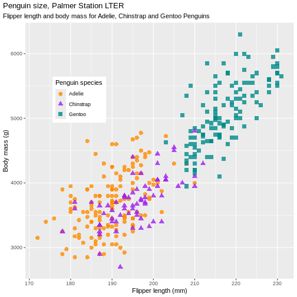

:::::::::::::::::::::::::::::::::::::: questions 


- How do I add a new Rmd file for additional analyses and incorporate it into my website?  

::::::::::::::::::::::::::::::::::::::::::::::::

::::::::::::::::::::::::::::::::::::: objectives

- Use `workflowr` function `wflow_publish()` to publish your website.  
- Add exploratory data analysis R code (and outputs like figures) to your analysis  
- Recognize that "publishing" your website synchronizes html files (ie, those outputted from rendering Rmd files) and the source Rmd files. By itself, it doesn't post your site to the internet.       


::::::::::::::::::::::::::::::::::::::::::::::::

## `workflowr` & "publishing" analysis website  

- `wflow_publish` to synchronize outputted htmls and source Rmds  


{width=50%}


```r
install.packages("palmerpenguins")
```


```r
library(palmerpenguins)
data(package = 'palmerpenguins')
head(penguins)
```

```{.output}
# A tibble: 6 × 8
  species island    bill_length_mm bill_depth_mm flipper_length_mm body_mass_g
  <fct>   <fct>              <dbl>         <dbl>             <int>       <int>
1 Adelie  Torgersen           39.1          18.7               181        3750
2 Adelie  Torgersen           39.5          17.4               186        3800
3 Adelie  Torgersen           40.3          18                 195        3250
4 Adelie  Torgersen           NA            NA                  NA          NA
5 Adelie  Torgersen           36.7          19.3               193        3450
6 Adelie  Torgersen           39.3          20.6               190        3650
# ℹ 2 more variables: sex <fct>, year <int>
```


```r
str(penguins)
```

```{.output}
tibble [344 × 8] (S3: tbl_df/tbl/data.frame)
 $ species          : Factor w/ 3 levels "Adelie","Chinstrap",..: 1 1 1 1 1 1 1 1 1 1 ...
 $ island           : Factor w/ 3 levels "Biscoe","Dream",..: 3 3 3 3 3 3 3 3 3 3 ...
 $ bill_length_mm   : num [1:344] 39.1 39.5 40.3 NA 36.7 39.3 38.9 39.2 34.1 42 ...
 $ bill_depth_mm    : num [1:344] 18.7 17.4 18 NA 19.3 20.6 17.8 19.6 18.1 20.2 ...
 $ flipper_length_mm: int [1:344] 181 186 195 NA 193 190 181 195 193 190 ...
 $ body_mass_g      : int [1:344] 3750 3800 3250 NA 3450 3650 3625 4675 3475 4250 ...
 $ sex              : Factor w/ 2 levels "female","male": 2 1 1 NA 1 2 1 2 NA NA ...
 $ year             : int [1:344] 2007 2007 2007 2007 2007 2007 2007 2007 2007 2007 ...
```


```r
# install tidyverse R package
install.packages("tidyverse")
```


```r
library(tidyverse)
```

```{.output}
── Attaching core tidyverse packages ──────────────────────── tidyverse 2.0.0 ──
✔ dplyr     1.1.4     ✔ readr     2.1.5
✔ forcats   1.0.0     ✔ stringr   1.5.1
✔ ggplot2   3.5.0     ✔ tibble    3.2.1
✔ lubridate 1.9.3     ✔ tidyr     1.3.1
✔ purrr     1.0.2     
── Conflicts ────────────────────────────────────────── tidyverse_conflicts() ──
✖ dplyr::filter() masks stats::filter()
✖ dplyr::lag()    masks stats::lag()
ℹ Use the conflicted package (<http://conflicted.r-lib.org/>) to force all conflicts to become errors
```

```r
penguins |> 
  count(species)
```

```{.output}
# A tibble: 3 × 2
  species       n
  <fct>     <int>
1 Adelie      152
2 Chinstrap    68
3 Gentoo      124
```

```r
penguins |> 
  group_by(species) |> 
  summarize(across(where(is.numeric), mean, na.rm = TRUE))
```

```{.warning}
Warning: There was 1 warning in `summarize()`.
ℹ In argument: `across(where(is.numeric), mean, na.rm = TRUE)`.
ℹ In group 1: `species = Adelie`.
Caused by warning:
! The `...` argument of `across()` is deprecated as of dplyr 1.1.0.
Supply arguments directly to `.fns` through an anonymous function instead.

  # Previously
  across(a:b, mean, na.rm = TRUE)

  # Now
  across(a:b, \(x) mean(x, na.rm = TRUE))
```

```{.output}
# A tibble: 3 × 6
  species   bill_length_mm bill_depth_mm flipper_length_mm body_mass_g  year
  <fct>              <dbl>         <dbl>             <dbl>       <dbl> <dbl>
1 Adelie              38.8          18.3              190.       3701. 2008.
2 Chinstrap           48.8          18.4              196.       3733. 2008.
3 Gentoo              47.5          15.0              217.       5076. 2008.
```


## Penguin mass vs. flipper length


```r
mass_flipper <- ggplot(data = penguins, 
                       aes(x = flipper_length_mm,
                           y = body_mass_g)) +
  geom_point(aes(color = species, 
                 shape = species),
             size = 3,
             alpha = 0.8) +
  scale_color_manual(values = c("darkorange","purple","cyan4")) +
  labs(title = "Penguin size, Palmer Station LTER",
       subtitle = "Flipper length and body mass for Adelie, Chinstrap and Gentoo Penguins",
       x = "Flipper length (mm)",
       y = "Body mass (g)",
       color = "Penguin species",
       shape = "Penguin species") +
  theme(legend.position = c(0.2, 0.7),
        plot.title.position = "plot",
        plot.caption = element_text(hjust = 0, face= "italic"),
        plot.caption.position = "plot")
```

```{.warning}
Warning: A numeric `legend.position` argument in `theme()` was deprecated in ggplot2
3.5.0.
ℹ Please use the `legend.position.inside` argument of `theme()` instead.
This warning is displayed once every 8 hours.
Call `lifecycle::last_lifecycle_warnings()` to see where this warning was
generated.
```

```r
mass_flipper
```

```{.warning}
Warning: Removed 2 rows containing missing values or values outside the scale range
(`geom_point()`).
```




:::::::::::::::::::::::::::::::::::::: challenge

### How do I plot 

:::::::::::::: solution

### Understanding `wflow_publish` arguments


:::::::::::::::::::::::::

::::::::::::::::::::::::::::::::::::::::::::::::::


