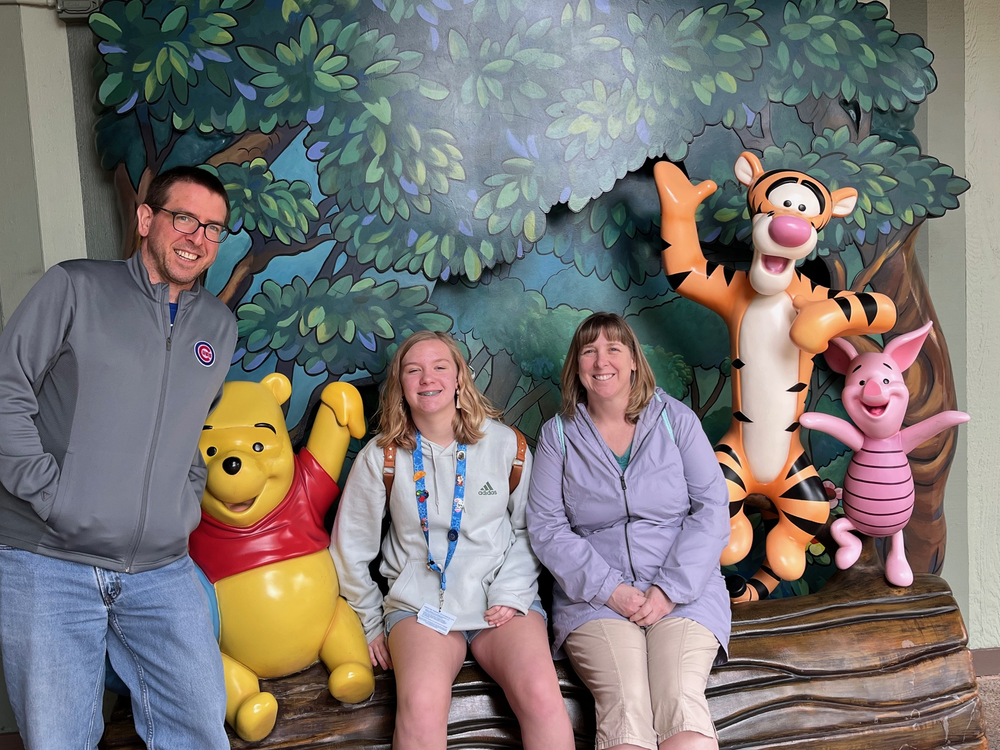

:::::::::::::::::::::::::::::::::::::: questions 

- Who am I?   
- Why am I here?  
- Who are you?   
- Why are you here?    

::::::::::::::::::::::::::::::::::::::::::::::::

::::::::::::::::::::::::::::::::::::: objectives

- Introduce Fred as workshop instructor and facilitator  (and a resource after the workshop)  
- Participants can share names and fun facts about themselves  

::::::::::::::::::::::::::::::::::::::::::::::::

## Fred Boehm

Homepage: https://fboehm.us/   
Github: https://github.com/fboehm/  
Email: frederick.boehm@gmail.com  
- R user since 2007  
- R package maintainer for `qtl2pleio` & `gemma2` for use in genetics studies  

**Please email me with followup questions, workshop requests, or suggestions for additional resources**   
- *I may not have the answers, but I will try my best to find them*  

## Workshop participants

- Please feel free to turn on microphone and share your name, experience with R programming, and workshop goals. Also, we welcome sharing of a "fun fact" or peronal hobby.  
- If you like, you are also encouraged to share information in the zoom chat.  

